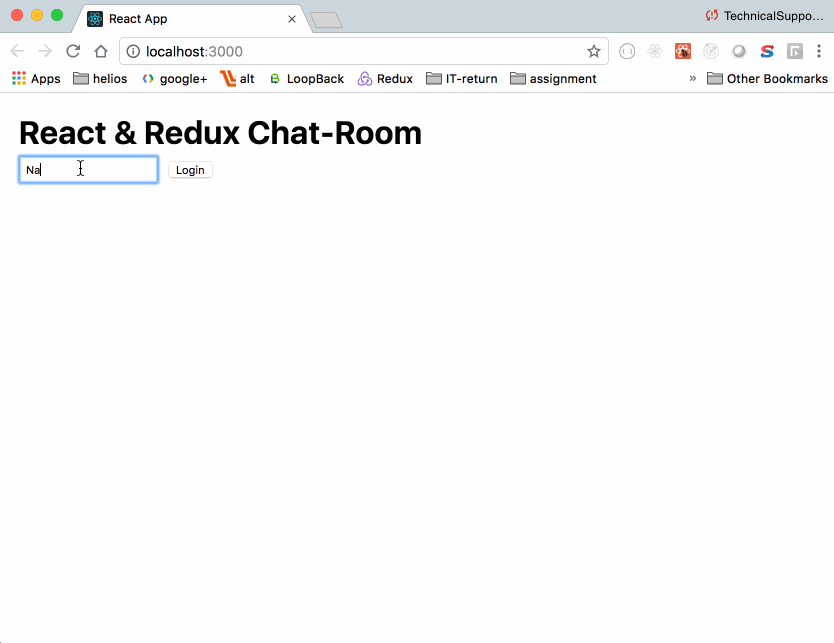

# React-Chat-Kit
Chat Application with ReactJS

### Chat Application -


### Dependencies & DevDependencies -
```
Express, react, react-dom, react-scripts & concurrently
```

### To install all the dependencies -
```
cd react-chat-kit
npm install
```

### To Run the Local Server -
```
npm start
```

### Changelog -
> 0.0.1: version

### Licence []()
> The MIT License (MIT)

